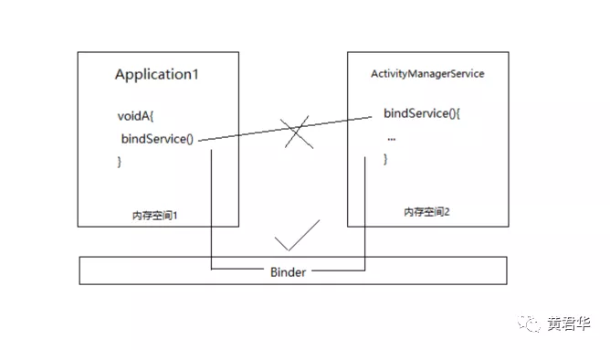
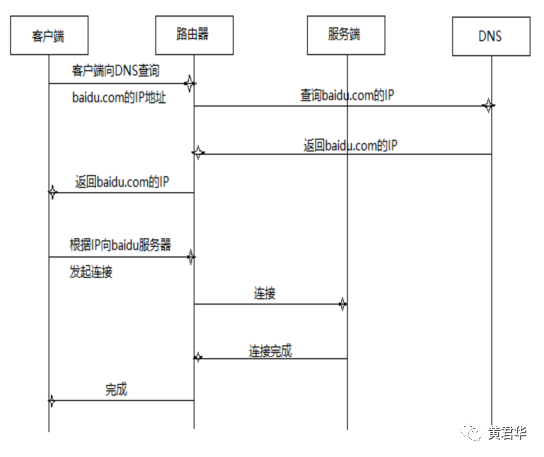
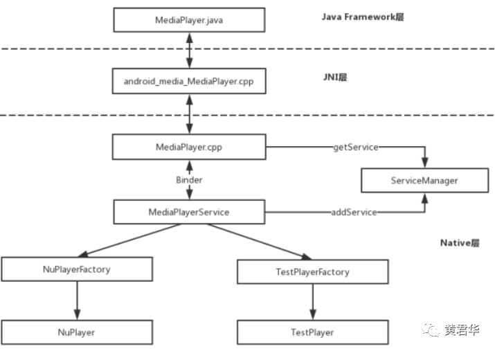
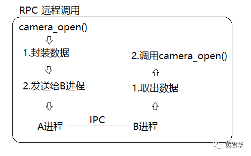
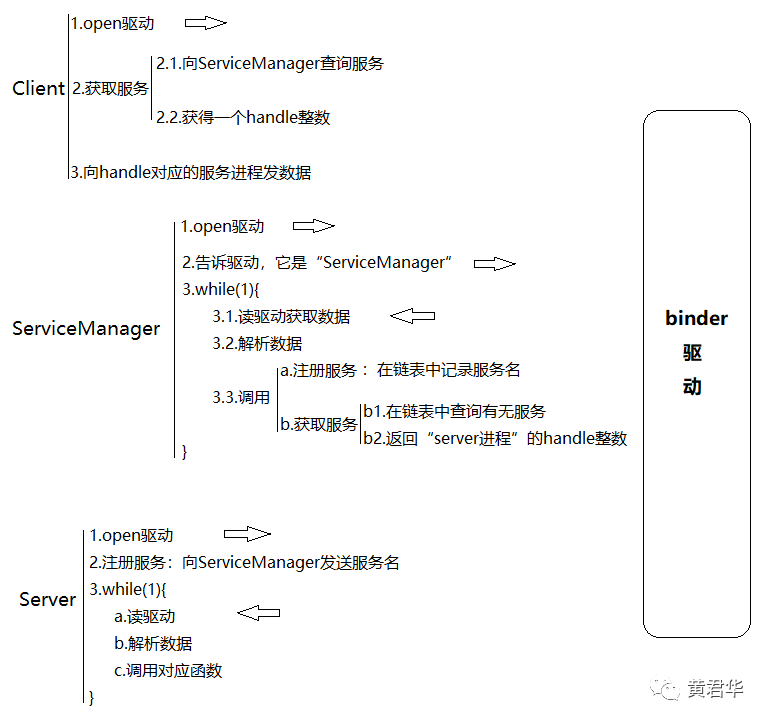

### **简单了解Binder是什么**

https://mp.weixin.qq.com/s/rQJ1Q6YcXNSEmFp74OJv9Q

我们知道，同一个程序中的两个函数之间能直接调用的根本原因是**处于相同的内存空间**。
打个比喻：两个进程就是俩国家，国民不能随心所欲的造访，在Android系统中，进程也是这样，它们是没有办法直接通过内存地址来访问到对方内部的函数或者变量。既然无法“直接”访问到对方进程的内存空间，那有没有“间接”的方法呢？——Binder。



### **Binder组成元素**

可以把它的组成元素比喻成TCP/IP网络连接过程。





1. Binder驱动->路由器
2. ServiceManager->DNS
3. BinderClient->客户端
4. BinderServer->服务器

​    Binder的本质目标用一句话来描述，**就是进程A（客户端）希望与进程B（服务器）进行互访**。但因为它们之间是跨进程（跨网络）的，所以必须借助于Binder驱动（路由器）来把请求正确投递到对方所在进程（网络）中。而参与通信的进程们需要持有Binder”颁发”的唯一标志（IP地址）。
ServiceManager(DNS),用于管理Binder标志与可读性更强的Binder服务名称（域名）之间的对应关系，并向用户提供查询功能。

**举个栗子**




 可以看到，MediaPlayer和MediaPlayerService是通过Binder来进行通信的，MediaPlayer是Client端，MediaPlayerService是Server端，MediaPlayerService是系统多媒体服务的一种，系统多媒体服务是由一个叫做MediaServer的服务进程提供的。

​    ServiceManager是Binder机制中的“DNS服务器”，负责域名（某Binder服务在ServiceManager注册时提供的名称）到IP地址（由底层Binder驱动分配的值）的解析。

​    ServiceManager的功能比较简洁。内部维护着一个svclist列表，用于存储所有Server相关信息，查询和注册都是基于这个表展开的。

**框架分析**

- **IPC**

​    IPC是进程间的通信，比如A进程想把数据原原本本的发给B进程。


**RPC**

RPC是远程过程（函数）调用，比如A进程想调用camera_open()函数，但是它没有权限操作驱动程序，所以需要借助IPC将camera_open()函数需要的参数发送给B进程，实际上由B进程去操作，但是这对上层是无感知的。




**B进程有多个函数，它怎么知道调用哪一个？**

在Android系统中，**所有的函数都会有一个编号**，我们只需要把camera_open()的函数编号也传进去就可以了。

**需要传给它什么参数？**

这个需要根据调用的函数实际情况来定，比如camera_open()可能需要摄像头的ID值。

**返回值？**

返回值就是进程B处理完成后把结果原路返回。


**Client-ServiceManager-Server**





通过上图，我们明白了Binder通信离不开binder驱动，比如Client需要获取服务，只需要把数据发送给binder驱动，指名要发送给ServiceManager，binder驱动知道谁是ServiceManager。


**源码分析**

```c

frameworks/native/cmds/servicemanager/service_manager.c:349

int main(int argc, char **argv)
{
    struct binder_state *bs;
    /*open驱动*/
    bs = binder_open(128*1024);
    if (!bs) {
        ALOGE("failed to open binder driver\n");
        return -1;
    }
    /*告诉驱动，它是ServiceManager\binder_become_context_manager(bs)*/
    if (binder_become_context_manager(bs)) {
        ALOGE("cannot become context manager (%s)\n", strerror(errno));
        return -1;
    }
    ...
    svcmgr_handle = BINDER_SERVICE_MANAGER;
    /*while循环：a读驱动获取数据 b解析数据 c调用注册\获取服务操作*/
    binder_loop(bs, svcmgr_handler);

    return 0;
}
```

**ServiceManager**

1. **binder_open**

  — open驱动，内部将会打开驱动程序，执行mmap内存映射等操作，本篇只关心流程

2. **binder_become_context_manager**

  — 告诉驱动，它是ServiceManager

3. **binder_loop(bs, svcmgr_handler);**

  —上面说到binder_loop是一个while循环，我们接下来深入函数内部去分析

```java

frameworks/native/cmds/servicemanager/binder.c:369
/* binder_loop它有两个参数：
* bs：一个对象，记录了binder驱动状态值以及映射内存区域size值，是openBinder的返回值
* func：它是一个函数svcmgr_handler，就是传入一个函数，等会可以直接调用
*/
void binder_loop(struct binder_state *bs, binder_handler func)
{
    int res;
    struct binder_write_read bwr;
    uint32_t readbuf[32];
    bwr.write_size = 0;
    bwr.write_consumed = 0;
    bwr.write_buffer = 0;

    readbuf[0] = BC_ENTER_LOOPER;
    binder_write(bs, readbuf, sizeof(uint32_t));
    /*这里验证了binderloop确实是会循环读取来自驱动的数据，但不是while循环*/
    for (;;) {
        bwr.read_size = sizeof(readbuf);
        bwr.read_consumed = 0;
        bwr.read_buffer = (uintptr_t) readbuf;
        /*读驱动获取数据*/
        res = ioctl(bs->fd, BINDER_WRITE_READ, &bwr);

        if (res < 0) {
            ALOGE("binder_loop: ioctl failed (%s)\n", strerror(errno));
            break;
        }
        /*解析数据*/
        res = binder_parse(bs, 0, (uintptr_t) readbuf, bwr.read_consumed, func);
        if (res == 0) {
            ALOGE("binder_loop: unexpected reply?!\n");
            break;
        }
        if (res < 0) {
            ALOGE("binder_loop: io error %d %s\n", res, strerror(errno));
            break;
        }
    }
}
```

​	3.1. res=ioctl(bs->fd, BINDER_WRITE_READ, &bwr);

​	    —通过ioctl函数，读取驱动获取数据

3.2. **binder_parse**

​    —获取完数据之后需要进行解析，我们继续深入函数内分析

   

```java
frameworks/native/cmds/servicemanager/binder.c:201
/* binder_loop它有五个参数：
* bs：一个对象，记录了binder驱动状态值以及映射内存区域size值，是openBinder的返回值
* bio：一个数据包，从驱动获取的，实际上是来自于Client/Server发送给servicemanager的数据，这里暂不关心
* ptr：其实是 来自于驱动的readbuf数据，保存了当前请求是查询/添加服务的code值，以及一些必要数据
* size：read缓存空间已用大小，这里不关心
* func：它是一个函数svcmgr_handler，就是传入一个函数，等会可以直接调用
*/
int binder_parse(struct binder_state *bs, struct binder_io *bio,
                 uintptr_t ptr, size_t size, binder_handler func)
{
    int r = 1;
    uintptr_t end = ptr + (uintptr_t) size;

    while (ptr < end) {
        uint32_t cmd = *(uint32_t *) ptr;
        ptr += sizeof(uint32_t);
#if TRACE
        fprintf(stderr,"%s:\n", cmd_name(cmd));
#endif
        switch(cmd) {
        case BR_NOOP:
            break;
        case BR_TRANSACTION_COMPLETE:
            break;
        ...
        case BR_TRANSACTION: {
            /*从binder驱动读取的readbuf中获取binder_transaction_data*/
            struct binder_transaction_data *txn = (struct binder_transaction_data *) ptr;
            if ((end - ptr) < sizeof(*txn)) {
                ALOGE("parse: txn too small!\n");
                return -1;
            }
            binder_dump_txn(txn);
            if (func) {
                unsigned rdata[256/4];
                struct binder_io msg;
                struct binder_io reply;
                int res;

                bio_init(&reply, rdata, sizeof(rdata), 4);
                bio_init_from_txn(&msg, txn);
                /*除了解析数据，这里func还会处理数据，实际上交给传进来的svcmgr_handler函数去实现*/
                res = func(bs, txn, &msg, &reply);
                /*有必要的话，处理完数据后会发送回复信息*/
                binder_send_reply(bs, &reply, txn->data.ptr.buffer, res);
            }
            ptr += sizeof(*txn);
            break;
        }
        case BR_REPLY: {
          ...
         
            break;
        }
        case BR_DEAD_BINDER: {
           ...
            break;
        }
        ...
        }
    }

    return r;
}
```


