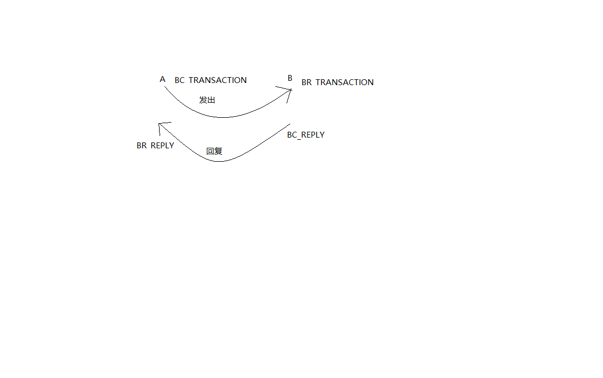
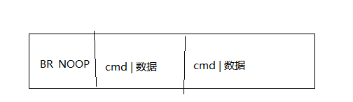
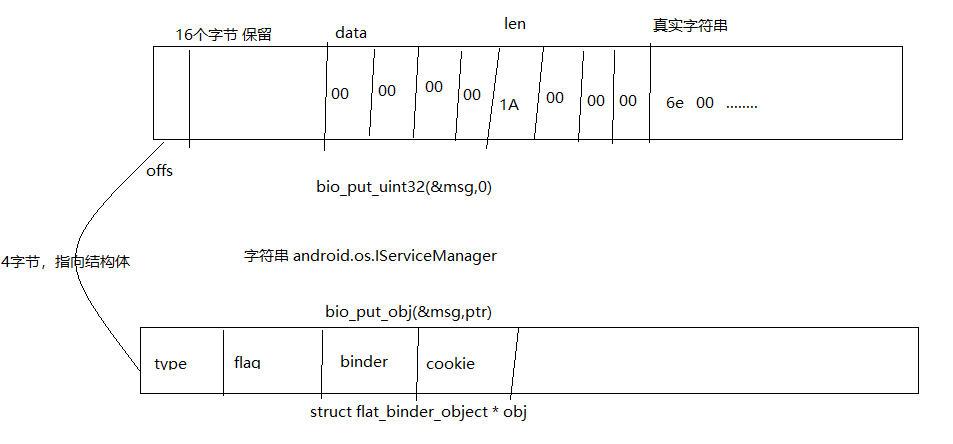
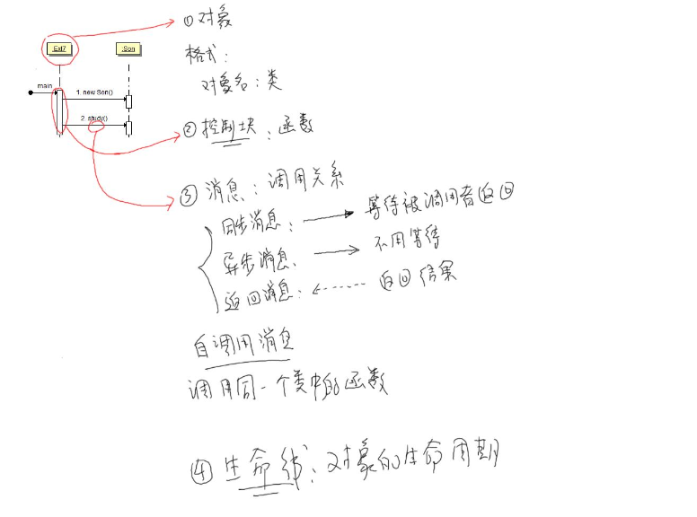

### binder 系统核心

IPC: 进程间的通信。A进程把数据发送到B进程。

RPC: 远程过程调用其它进程的某个函数。

​	调用哪一个函数？server 函数编号。例如：第一号，第二号。调用哪个函数就把编号发给它。

​        传给它什么参数？放到RPC的buf传给它。 里面返回值，也是同理通过buf 传回去的。双方约定好传输格式。

​        把数据发送给B，由B程序来操作硬件。在IPC的基础上做了一些封装。

ipc 是基础，负责数据传输。三大要素：

1，源：进程a .。问题？进程a 怎么知道进程b提供led 的访问？进程a如果操作c呢？应该向哪个进程发送数据？

2，目的 : 进程b。进程B 向serviceManager 注册led服务。进程A向serviceManager 查询led服务。得到一个handle。这个handle 就是指向进程B。

3，数据本身：就是char buf 。双方约定好数据的格式。

**对于Binder 系统涉及4个东西。**


 **ServiceManager**                        

  ① open 驱动

 ② 告诉驱动，它是serviceManager .

 ③  while 循环

​	    读驱动，获取数据

​	    解析数据

​	    调用两个函数

​	    a: 注册服务{在链表中 记录服务名字}

​	     b: 获取服务{b1:在链表中查询有没有服务 b2: 返回server 进程的handle}

**server**

​     ① open驱动

​     ② 注册服务{向serviceManager 发送服务的名字，把数据写入驱动程序}

​     ③ while循环 

​		读驱动

​		解析数据

​		调用对应的函数

​		


**client** 

  ①open驱动

  ②获取服务 {1，向serviceManger 查询服务获得一个handle，把数据发送驱动程序，指明要发给serviceManager.驱动程序知道谁是serviceManager}

  ③向handle 发送数据。


​					binder 驱动


参考代码：

frameworks\native\cmds\servicemanager 

**service_manager.c**

   **a,binder_open**

   **b,binder_become_context_manager** 告诉驱动，他是service_manager

   **c,binder_loop(bs,svcmgr_handler)**

​	c.1  res = ioctl(bs->fd, BINDER_WRITE_READ, &bwr); 读数据

​        c.2  binder_parse 除了解析数据还会处理数据

​		//解析

​		//处理：svcmgr_handler 注册服务，获取服务。

​			      SVC_MGR_GET_SERVICE /SVC_MGR_CHECK_SERVICE 获取服务

​			     SVC_MGR_ADD_SERVICE 注册服务。

​		//回复

​		 

**bctest.c**  半成品 。 实现了注册服务和获取服务。

**注册服务的过程：**

​	a.  binder_open

​	b.  svcmgr_publish , 构造好数据后，最终调用 binder_call ，要把数据发送到哪一个进程，由target来决定。 target 这里是0。句柄是0，进程间通信，要发送给谁。这个谁是用整数来表示的。当这个**整数是0 (BINDER_SERVICE_MANAGER)的时候，来表示要发送的是serviceManager** .它告诉驱动程序，本身自己就是serviceManager. 如果要把数据发送给为0的时候，驱动程序就知道要发给serviceManager. 

 binder_call(bs, &msg, &reply, target, SVC_MGR_ADD_SERVICE) ；

msg: 含有服务的名字。

reply:它会收到含有serviceManager 回复的数据。

code 表示调用serviceManager addService 

**获取服务的过程：**

a, binder_open

b,  svcmgr_lookup ，binder_call(bs, &msg, &reply, target, SVC_MGR_CHECK_SERVICE) 

​					msg: 含有服务的名字

​                                         reply: 它会含有servicemanager 回复的数据，表示提供服务的过程。

​					  code :表示调用serviceManager getService 

​                                      

### **binder.c** 分析  封装好的c函数。

binder_call 远程调用。向谁发数据。调用谁的哪个函数？提供什么参数。返回值是什么？

int binder_call(struct binder_state *bs,
                struct binder_io *msg, struct binder_io *reply,
                uint32_t target, uint32_t code)

向谁发数据：target 

调用哪个函数：code 

提供什么参数: msg 

返回值：reply 

怎么用？

①：构造参数放在buffer 。用结构体来描述。binder_io 。

②：调用 ioctl 来发数据。   res = ioctl(bs->fd, BINDER_WRITE_READ, &bwr);

​      **bwr**:   struct binder_write_read bwr;

	构造的是binder_io , 用到的是binder_write_read , 转换成驱动程序所要求的binder_write_read ?

​	转换：binder_io 转换 - > binder_write_read;过程

③：ioctl 也会收数据 。也会收到binder_write_read. 

​	也要转换成 binder_io .


例子：怎么构造binder_io，binder_io 会指向一个缓冲区。这个缓冲区是iodata ,实际上binder_io 是对这个缓冲区的管理。首先初始化，然后就可以对缓冲区里面放数据了。


iodata :放数据的地方.

binder_io 用来描述iodata 的buf .

可以在iodata 中放入 int ,字符串等。构造好了之后，就会调用binder call .

数据发送给驱动程序，数据中除了binder_io 之外，还有target,code ,msg. **他们一起构造binder_write_read** 


writeBuf 定义：

 


**binder_call内部实现**


**Client:** 

a,  binder_open。

b, 获得服务：服务进程的handle。

c, 构造参数：binder_io 

d，调用binder_call (handle,code,binder_io,)

e，binder_call 返回binder_io ，分析，取出返回值 （放在一个buf 中）

**server:**

a,binder_open

b,注册服务

c,ioctl (读) ，读到的数据是client发送的。，读取到handle,code ,参数

d,解析数据。得到binder_write_read ，readbuf -> 指向binder_transation_data 。 转换binder_io 

e,根据code ,来决定调用什么函数了。从binder_io 取出参数。传给要调用的函数，处理完之后，把返回值再次转换为binder_io 发给client 。


1，server 为在内核态驱动里 每个服务创建binder_node , binder_node.proc = server进程

2，service_manager  内核态驱动里 创建binder_ref ，引用binder_node 

​	 binder_ref.desc = 1,2,3.....

在用户态 创建服务链表 .链表中有name,有handle ，handle = binder_rer.desc

3,client 想service_manager 查询服务，传入name.

4,service_manager 返回handle给内核态，给驱动程序

5，驱动程序在service_manager 的binder_ref 红黑树。根据handle 找到binder_ref,在根据binder_ref.node 找到binder_node,

最后给这个client  创建新的binder_ref ，它的desc 从1开始。

驱动返回desc 给client ,它即为handle .

6,client 发送 到handle ,导致什么操作呢？

驱动根据handle 找到binder_ref ,在根据binder_ref 找到binder_node ,

在根据binder_node 找到server进程。

client 调用binder_call 向目的进程发送数据，handle 表示目的进程，binder_call 最终调用io_ctrl ,意味着，驱动程序使用handle 找到目的进程。在驱动内部，肯定有一个结构体来描述这个引用，它就是binder_ref

binder_ref 表示对服务的引用，那么怎么表示服务的呢？服务是binder_node .

驱动程序根据handle 找到binder_ref ,binder_ref 表示对某个服务的引用，根据binder_node *node ,找到对应的服务的binder_node ，在根据binder_node 中 binder_proc * proc找到对应进程.

**找到进程后，就可以把数据放到进程的某个链表中去了。**


真是的应用场景，会有多个client程序要求进程 提供服务。目标进程就会创建多个线程来向client 程序提供服务，进程B肯定有一个结构体来管理线程。就是**struct rb_root  threads;** 他是个红黑树，树的下面会挂有多个线程，线程会用binder_thread 来表示。每一个线程都会有binder_thread 结构体。


**binder_ref** 

binder_ref 用来描述一个Binder 引用的对象，在android 系统中，每一个 client 组件在Binder 驱动程序都有一个binder 引用对象。

**handle 是一个引用，进程a 对进程b提供的服务 的引用。**


**binder_node** 
结构体binder_node 用来定义Binder 实体对象，在android系统中，每一个service 组件在binder 驱动程序中都有一个Binder实体对象。


**binder_proc**

结构体binder_proc 表示正在使用的Binder 进程通信机制的进程，能够保存调用Binder的各个进程或线程信息，例如线程ID，进程ID，Binder 状态信息等。


找到binder_ref 就可以根据 node 找到bInder_node


client 是想向进程b发送数据，用handle 来表示进程b,通过handle 找到binder_ref 。通过binder_ref 找到node .通过binder_node 找到进程B，谁来表示进程B？在binder驱动中，使用binder_proc 来表示进程B。


binder_proc  某个服务从属于某个进程的。


进程a向进程b发送数据，调用ioctrl 传入一个handle ,根据handle 找到binder_ref . binder_ref 里面的desc 的描述等于handle , binder_ref 里面有一个指针。指向binder_node ,binder_node 是表示一个服务，binder_node 里面，有一项是binder_proc ,binder_proc 就是对应进程B，就把数据放到进程B的某个链表里面去了。

真实的应用场景会有多个client 程序，来向这个进程B要求提供服务，进程B就会创建多个线程，来向client 程序提供服务。进程B里面肯定有个结构体来管理线程。

### **binder 节点总结：**

binder_proc 中有 **rb_root  threads** ;是一个红黑树，这个树里面挂着多个线程，线程就是使用binder_thread 来表示。每一个线程都有个binder_thread 结构体。在这个引用过程中 源头是谁？

源头是server 的binder_node .

1,首先在内核态创建binder_node 别人才能引用你。server 为每个服务创建binder_node。binder_node 里面有proc 选项，binder_node.proc = server 进程。

2,service_manager 会在内核里面创建binder_ref 引用 binder_node .   binder_ref  有一项整数，binder_ref.desc = 1,2,3....

在用户态会创建服务链表，链表中有 服务的名字，hander  。 这个handle binder_ref.desc

3,client 向service_manager 查询服务。传name

4，service_manager 返回handle  给内核态给驱动程序。

5，驱动程序在service_manager 的binder_ref 红黑树中根据handle 找到bineder_ref 在根据binder_ref.node 找到binder_node 。

最后，给client 创建新的binder_ref .指向binder_node . 它的desc 从1 开始。

**驱动返回desc 给client 就是handle 。**

6，client 发送给handle ,驱动根据handle 找到binder_ref 。每个进程都有一些列binder_ref 根据整数号找到binder_ref 。再根据binder_ref 找到binder_node .根据binder_node 找到 server 进程 . 就可以传数据了


创建binder 是再内核态里面，所有的创建binder_node,binder_ref 都是再内核态驱动程序里面创建的。


### 数据传输过程（先写后读，进程切换）


### 数据如何复制

为了提供传输效率，使用mmap , 用户态可以直接操作内核态的内存。如果不使用mmap 来如何传输数据？

**一般方法** 

①client 构造好数据   。需要两次复制，效率比较低

② 驱动 copy_from_user    

**server**:

 1,驱动 copy_to_user

 2， 用户态处理。

**binder 方法**

① server mmap 用户态可以直接防访问 驱动中某块内存。

② client 构造数 驱动程序：copy_from_user  把用户态复制到内核的这块内存中。

③ server **程序客户以在用户态，直接使用数据。所以只需要一次拷贝。** 

④ 涉及结构体binder_buffer  。 数据只需要复制一次，数据头还是需要复制两次的。

例如:

​    io_ctrl 需要binder_write_read 这个结构体需要复制两次。这个结构体有某个指针指向发送的数据。

​    copy_from_user 到内存局部变量，然后copy_to_user 到service。而数据本身只需要一次复制。


gi clone https://github.com/weidongshan/APP_0003_Binder_C_App.git


#### 情景分析

应用程序调用ioctl 来和驱动程序进行交互，会传入结构体，binder_write_read 结构体。

```
res= ioctl(bs->fd,BINDER_WRITE_READ,&bwr);
```

写数据的时候，binder_write_read 的 write_buffer 会指向数据本身，

write_buffer，read_buffer 

```
struct {
	uint32_t cmd;
	struct binder_transaction_data txn;
}__attribute__((packed))writebuf;
```

write_buffer数据是怎么组织的呢？前面4个字节来表示数据类型。后面紧跟着要发送的数据。

当读数据的时候，读取的是binder_write_read 结构体。读取的read_buffer 和 write_buffer 的数据结构体类似。前面四个字节来表示读取的数据类型，后面紧跟着数据本身。

应用程序调用ioctl,传入BINDER_WRITE_READ宏，对应驱动程序的binder_ioctl (Binder.c)，

cmd 变量就会接收到BINDER_WRITE_READ，（参考binder_ioctl_write_read 函数）会从用户空间得到binder_write_read 结构体，分辨read_size,write_size .分别调用binder_thread_read，binder_thread_write函数。在这两个函数里可以添加打印所有的消息类型。

/*print infor: proc'name ,proc id ,thread id ,cmd'name*/

如何打印数据？

binder_thread_read ，binder_thread_write 写读数据分别关心，BR_TRANSACTION,BC_TRANSACTION


写数据的时候，最终会调用

```java
binder_transaction(proc, thread, &tr.transaction_data,
					   cmd == BC_REPLY_SG, tr.buffers_size);
```


```java
static long binder_ioctl(struct file *filp, unsigned int cmd, unsigned long arg)
{
	int ret;
	struct binder_proc *proc = filp->private_data;
	struct binder_thread *thread;
	unsigned int size = _IOC_SIZE(cmd);
	void __user *ubuf = (void __user *)arg;

	/*pr_info("binder_ioctl: %d:%d %x %lx\n",
			proc->pid, current->pid, cmd, arg);*/

	binder_selftest_alloc(&proc->alloc);

	trace_binder_ioctl(cmd, arg);

	ret = wait_event_interruptible(binder_user_error_wait, binder_stop_on_user_error < 2);
	if (ret)
		goto err_unlocked;

	thread = binder_get_thread(proc);
	if (thread == NULL) {
		ret = -ENOMEM;
		goto err;
	}

	switch (cmd) {
	case BINDER_WRITE_READ:
		ret = binder_ioctl_write_read(filp, cmd, arg, thread);
		if (ret)
			goto err;
		break;
	case BINDER_SET_MAX_THREADS: {
		int max_threads;

		if (copy_from_user(&max_threads, ubuf,
				   sizeof(max_threads))) {
			ret = -EINVAL;
			goto err;
		}
		binder_inner_proc_lock(proc);
		proc->max_threads = max_threads;
		binder_inner_proc_unlock(proc);
		break;
	}
	case BINDER_SET_CONTEXT_MGR:
		ret = binder_ioctl_set_ctx_mgr(filp);
		if (ret)
			goto err;
		break;
	case BINDER_THREAD_EXIT:
		binder_debug(BINDER_DEBUG_THREADS, "%d:%d exit\n",
			     proc->pid, thread->pid);
		binder_thread_release(proc, thread);
		thread = NULL;
		break;
	case BINDER_VERSION: {
		struct binder_version __user *ver = ubuf;

		if (size != sizeof(struct binder_version)) {
			ret = -EINVAL;
			goto err;
		}
		if (put_user(BINDER_CURRENT_PROTOCOL_VERSION,
			     &ver->protocol_version)) {
			ret = -EINVAL;
			goto err;
		}
		break;
	}
	case BINDER_GET_NODE_DEBUG_INFO: {
		struct binder_node_debug_info info;

		if (copy_from_user(&info, ubuf, sizeof(info))) {
			ret = -EFAULT;
			goto err;
		}

		ret = binder_ioctl_get_node_debug_info(proc, &info);
		if (ret < 0)
			goto err;

		if (copy_to_user(ubuf, &info, sizeof(info))) {
			ret = -EFAULT;
			goto err;
		}
		break;
	}
	default:
		ret = -EINVAL;
		goto err;
	}
	ret = 0;
err:
	if (thread)
		thread->looper_need_return = false;
	wait_event_interruptible(binder_user_error_wait, binder_stop_on_user_error < 2);
	if (ret && ret != -ERESTARTSYS)
		pr_info("%d:%d ioctl %x %lx returned %d\n", proc->pid, current->pid, cmd, arg, ret);
err_unlocked:
	trace_binder_ioctl_done(ret);
	return ret;
}


static int binder_ioctl_write_read(struct file *filp,
				unsigned int cmd, unsigned long arg,
				struct binder_thread *thread)
{
	int ret = 0;
	struct binder_proc *proc = filp->private_data;
	unsigned int size = _IOC_SIZE(cmd);
	void __user *ubuf = (void __user *)arg;
	struct binder_write_read bwr;

	if (size != sizeof(struct binder_write_read)) {
		ret = -EINVAL;
		goto out;
	}
	if (copy_from_user(&bwr, ubuf, sizeof(bwr))) {
		ret = -EFAULT;
		goto out;
	}
	binder_debug(BINDER_DEBUG_READ_WRITE,
		     "%d:%d write %lld at %016llx, read %lld at %016llx\n",
		     proc->pid, thread->pid,
		     (u64)bwr.write_size, (u64)bwr.write_buffer,
		     (u64)bwr.read_size, (u64)bwr.read_buffer);

	if (bwr.write_size > 0) {
		ret = binder_thread_write(proc, thread,
					  bwr.write_buffer,
					  bwr.write_size,
					  &bwr.write_consumed);
		trace_binder_write_done(ret);
		if (ret < 0) {
			bwr.read_consumed = 0;
			if (copy_to_user(ubuf, &bwr, sizeof(bwr)))
				ret = -EFAULT;
			goto out;
		}
	}
	if (bwr.read_size > 0) {
		ret = binder_thread_read(proc, thread, bwr.read_buffer,
					 bwr.read_size,
					 &bwr.read_consumed,
					 filp->f_flags & O_NONBLOCK);
		trace_binder_read_done(ret);
		binder_inner_proc_lock(proc);
		if (!binder_worklist_empty_ilocked(&proc->todo))
			binder_wakeup_proc_ilocked(proc);
		binder_inner_proc_unlock(proc);
		if (ret < 0) {
			if (copy_to_user(ubuf, &bwr, sizeof(bwr)))
				ret = -EFAULT;
			goto out;
		}
	}
	binder_debug(BINDER_DEBUG_READ_WRITE,
		     "%d:%d wrote %lld of %lld, read return %lld of %lld\n",
		     proc->pid, thread->pid,
		     (u64)bwr.write_consumed, (u64)bwr.write_size,
		     (u64)bwr.read_consumed, (u64)bwr.read_size);
	if (copy_to_user(ubuf, &bwr, sizeof(bwr))) {
		ret = -EFAULT;
		goto out;
	}
out:
	return ret;
}
```


**binder 调用分析**

命令的详细介绍

http://blog.csdn.net/universus/article/details/6211589

binder 的通信会涉及到两个进程



只有BC_TRANSACTION,BR_TRANSACTION,BC_REPLY,BR_REPLY  涉及两进程，其他所有的cmd, BCXXX,BRXX,只是app和驱动的交互过程,用户改变或者报告状态。


#### **服务的注册过程**

应用程序怎么访问驱动程序？

app:open,read,write,ioctl访问驱动

驱动:drv_open,drv_read,drv_write ... 

怎么写驱动?

​	1,构造file_operator 结构体。

   .open=drv_open

   .read=drv_read

​	2,告诉内核 ： 注册驱动

​	register_chrdev();

​	3, 驱动程序的入口函数 调用register_chrdev。


分析：

1，首先service_manager 执行binder_thread_write:,传入BC_ENTER_OOPER

2,   接着发起binder_thread_read ，传入BR_NOOP，往后就休眠了，等待其他程序给他发送注册服务的消息。

​	  binder_open,打开驱动程序，获取版本信息，mmap 。 并没有引起binder_thread_read 操作。

​      接着调用binder_become_context_manager，ioctl(bs->fd, BINDER_SET_CONTEXT_MGR, 0); 告诉内核，这里就是Service_manager 。当其他的服务程序或者客户端程序，向handle 为0的节点发送数据的时候，驱动程序就可以找到Service_manager 进程。这里也不会引起binder_thread_write操作。

3，binder_loop 中，调用binder_write 发起一个写操作。操作的类型就是BC_ENTER_LOOPER，

```c
int main()
{
    struct binder_state *bs;

    bs = binder_open(128*1024);
    if (!bs) {
        ALOGE("failed to open binder driver\n");
        return -1;
    }

    if (binder_become_context_manager(bs)) {
        ALOGE("cannot become context manager (%s)\n", strerror(errno));
        return -1;
    }

    selinux_enabled = is_selinux_enabled();
    sehandle = selinux_android_service_context_handle();
    selinux_status_open(true);

    if (selinux_enabled > 0) {
        if (sehandle == NULL) {
            ALOGE("SELinux: Failed to acquire sehandle. Aborting.\n");
            abort();
        }

        if (getcon(&service_manager_context) != 0) {
            ALOGE("SELinux: Failed to acquire service_manager context. Aborting.\n");
            abort();
        }
    }

    union selinux_callback cb;
    cb.func_audit = audit_callback;
    selinux_set_callback(SELINUX_CB_AUDIT, cb);
    cb.func_log = selinux_log_callback;
    selinux_set_callback(SELINUX_CB_LOG, cb);

    binder_loop(bs, svcmgr_handler);

    return 0;
}
static int binder_open(struct inode *nodp, struct file *filp)
{
	struct binder_proc *proc;
	struct binder_device *binder_dev;

	binder_debug(BINDER_DEBUG_OPEN_CLOSE, "binder_open: %d:%d\n",
		     current->group_leader->pid, current->pid);

	proc = kzalloc(sizeof(*proc), GFP_KERNEL);
	if (proc == NULL)
		return -ENOMEM;
	spin_lock_init(&proc->inner_lock);
	spin_lock_init(&proc->outer_lock);
	get_task_struct(current->group_leader);
	proc->tsk = current->group_leader;
	INIT_LIST_HEAD(&proc->todo);
	if (binder_supported_policy(current->policy)) {
		proc->default_priority.sched_policy = current->policy;
		proc->default_priority.prio = current->normal_prio;
	} else {
		proc->default_priority.sched_policy = SCHED_NORMAL;
		proc->default_priority.prio = NICE_TO_PRIO(0);
	}

	binder_dev = container_of(filp->private_data, struct binder_device,
				  miscdev);
	proc->context = &binder_dev->context;
	binder_alloc_init(&proc->alloc);

	binder_stats_created(BINDER_STAT_PROC);
	proc->pid = current->group_leader->pid;
	INIT_LIST_HEAD(&proc->delivered_death);
	INIT_LIST_HEAD(&proc->waiting_threads);
	filp->private_data = proc;

	mutex_lock(&binder_procs_lock);
	hlist_add_head(&proc->proc_node, &binder_procs);
	mutex_unlock(&binder_procs_lock);

	if (binder_debugfs_dir_entry_proc) {
		char strbuf[11];

		snprintf(strbuf, sizeof(strbuf), "%u", proc->pid);
		/*
		 * proc debug entries are shared between contexts, so
		 * this will fail if the process tries to open the driver
		 * again with a different context. The priting code will
		 * anyway print all contexts that a given PID has, so this
		 * is not a problem.
		 */
		proc->debugfs_entry = debugfs_create_file(strbuf, S_IRUGO,
			binder_debugfs_dir_entry_proc,
			(void *)(unsigned long)proc->pid,
			&binder_proc_fops);
	}

	return 0;
}

int binder_become_context_manager(struct binder_state *bs)
{
    return ioctl(bs->fd, BINDER_SET_CONTEXT_MGR, 0);
}


void binder_loop(struct binder_state *bs, binder_handler func)
{
    int res;
    struct binder_write_read bwr;
    uint32_t readbuf[32];

    bwr.write_size = 0;
    bwr.write_consumed = 0;
    bwr.write_buffer = 0;

    readbuf[0] = BC_ENTER_LOOPER;
    binder_write(bs, readbuf, sizeof(uint32_t));

    for (;;) {
        bwr.read_size = sizeof(readbuf);
        bwr.read_consumed = 0;
        bwr.read_buffer = (uintptr_t) readbuf;

        res = ioctl(bs->fd, BINDER_WRITE_READ, &bwr);

        if (res < 0) {
            ALOGE("binder_loop: ioctl failed (%s)\n", strerror(errno));
            break;
        }

        res = binder_parse(bs, 0, (uintptr_t) readbuf, bwr.read_consumed, func);
        if (res == 0) {
            ALOGE("binder_loop: unexpected reply?!\n");
            break;
        }
        if (res < 0) {
            ALOGE("binder_loop: io error %d %s\n", res, strerror(errno));
            break;
        }
    }
}


```


**调用过程分析**：

1,service_manager 调用ioctl, BC_ENTER_LOOPER,对应调用binder驱动的 binder_ioctl 函数。

binder_get_thread 获取结构体。

```c
void binder_loop(struct binder_state *bs, binder_handler func)
{
    int res;
    struct binder_write_read bwr;
    uint32_t readbuf[32];

    bwr.write_size = 0;
    bwr.write_consumed = 0;
    bwr.write_buffer = 0;

    readbuf[0] = BC_ENTER_LOOPER;
    binder_write(bs, readbuf, sizeof(uint32_t));

    for (;;) {
        bwr.read_size = sizeof(readbuf);
        bwr.read_consumed = 0;
        bwr.read_buffer = (uintptr_t) readbuf;

        res = ioctl(bs->fd, BINDER_WRITE_READ, &bwr);

        if (res < 0) {
            ALOGE("binder_loop: ioctl failed (%s)\n", strerror(errno));
            break;
        }

        res = binder_parse(bs, 0, (uintptr_t) readbuf, bwr.read_consumed, func);
        if (res == 0) {
            ALOGE("binder_loop: unexpected reply?!\n");
            break;
        }
        if (res < 0) {
            ALOGE("binder_loop: io error %d %s\n", res, strerror(errno));
            break;
        }
    }
}
```

```c
static long binder_ioctl(struct file *filp, unsigned int cmd, unsigned long arg)
{
	int ret;
	struct binder_proc *proc = filp->private_data;
	struct binder_thread *thread;
	unsigned int size = _IOC_SIZE(cmd);
	void __user *ubuf = (void __user *)arg;

	/*pr_info("binder_ioctl: %d:%d %x %lx\n",
			proc->pid, current->pid, cmd, arg);*/

	binder_selftest_alloc(&proc->alloc);

	trace_binder_ioctl(cmd, arg);

	ret = wait_event_interruptible(binder_user_error_wait, binder_stop_on_user_error < 2);
	if (ret)
		goto err_unlocked;

	thread = binder_get_thread(proc);
	if (thread == NULL) {
		ret = -ENOMEM;
		goto err;
	}

	switch (cmd) {
	case BINDER_WRITE_READ:
		ret = binder_ioctl_write_read(filp, cmd, arg, thread);
		if (ret)
			goto err;
		break;
	case BINDER_SET_MAX_THREADS: {
		int max_threads;

		if (copy_from_user(&max_threads, ubuf,
				   sizeof(max_threads))) {
			ret = -EINVAL;
			goto err;
		}
		binder_inner_proc_lock(proc);
		proc->max_threads = max_threads;
		binder_inner_proc_unlock(proc);
		break;
	}
	case BINDER_SET_CONTEXT_MGR:
		ret = binder_ioctl_set_ctx_mgr(filp);
		if (ret)
			goto err;
		break;
	case BINDER_THREAD_EXIT:
		binder_debug(BINDER_DEBUG_THREADS, "%d:%d exit\n",
			     proc->pid, thread->pid);
		binder_thread_release(proc, thread);
		thread = NULL;
		break;
	case BINDER_VERSION: {
		struct binder_version __user *ver = ubuf;

		if (size != sizeof(struct binder_version)) {
			ret = -EINVAL;
			goto err;
		}
		if (put_user(BINDER_CURRENT_PROTOCOL_VERSION,
			     &ver->protocol_version)) {
			ret = -EINVAL;
			goto err;
		}
		break;
	}
	case BINDER_GET_NODE_DEBUG_INFO: {
		struct binder_node_debug_info info;

		if (copy_from_user(&info, ubuf, sizeof(info))) {
			ret = -EFAULT;
			goto err;
		}

		ret = binder_ioctl_get_node_debug_info(proc, &info);
		if (ret < 0)
			goto err;

		if (copy_to_user(ubuf, &info, sizeof(info))) {
			ret = -EFAULT;
			goto err;
		}
		break;
	}
	default:
		ret = -EINVAL;
		goto err;
	}
	ret = 0;
err:
	if (thread)
		thread->looper_need_return = false;
	wait_event_interruptible(binder_user_error_wait, binder_stop_on_user_error < 2);
	if (ret && ret != -ERESTARTSYS)
		pr_info("%d:%d ioctl %x %lx returned %d\n", proc->pid, current->pid, cmd, arg, ret);
err_unlocked:
	trace_binder_ioctl_done(ret);
	return ret;
}
```


```c
static struct binder_thread *binder_get_thread(struct binder_proc *proc)
{
	struct binder_thread *thread;
	struct binder_thread *new_thread;

	binder_inner_proc_lock(proc);
	thread = binder_get_thread_ilocked(proc, NULL);
	binder_inner_proc_unlock(proc);
	if (!thread) {
		new_thread = kzalloc(sizeof(*thread), GFP_KERNEL);
		if (new_thread == NULL)
			return NULL;
		binder_inner_proc_lock(proc);
		thread = binder_get_thread_ilocked(proc, new_thread);
		binder_inner_proc_unlock(proc);
		if (thread != new_thread)
			kfree(new_thread);
	}
	return thread;
}
```

读数据是怎么排列的？

binder_write_buf -> readbuf 




**binder_io 怎么构造数据？**

```c
 bio_init(&msg, iodata, sizeof(iodata), 4);
    bio_put_uint32(&msg, 0);  // strict mode header
    bio_put_string16_x(&msg, SVC_MGR_NAME);
    bio_put_string16_x(&msg, name);
    bio_put_obj(&msg, ptr);
```


**bio_put_obj**


server 传入一个flat_binder_object 给驱动，在内核里面就会去创建binder_node. 根据这个结构体，去创建binder_node 。

```c
void bio_put_obj(struct binder_io *bio, void *ptr)
{
    struct flat_binder_object *obj;

    obj = bio_alloc_obj(bio);
    if (!obj)
        return;

    obj->flags = 0x7f | FLAT_BINDER_FLAG_ACCEPTS_FDS;
    obj->type = BINDER_TYPE_BINDER;
    obj->binder = (uintptr_t)ptr;
    obj->cookie = 0;
}
```

内核驱动程序，怎么知道在这么一堆数据中，会有flat_binder_object?

bio_alloc_obj 函数中，offs 指向这个结构体。

```c
static struct flat_binder_object *bio_alloc_obj(struct binder_io *bio)
{
    struct flat_binder_object *obj;

    obj = bio_alloc(bio, sizeof(*obj));

    if (obj && bio->offs_avail) {
        bio->offs_avail--;
        *bio->offs++ = ((char*) obj) - ((char*) bio->data0);
        return obj;
    }

    bio->flags |= BIO_F_OVERFLOW;
    return NULL;
}
```


string16 表示两个字节存一个字符。

bio_init 会把前面16个字节空出来。




binder_call 会根据构造好的binder_io 构造binder_write_read 结构体，会传给驱动程序。

```c
int binder_call(struct binder_state *bs,
                struct binder_io *msg, struct binder_io *reply,
                uint32_t target, uint32_t code)
{
    int res;
    struct binder_write_read bwr;
    struct {
        uint32_t cmd;
        struct binder_transaction_data txn;
    } __attribute__((packed)) writebuf;
    unsigned readbuf[32];

    if (msg->flags & BIO_F_OVERFLOW) {
        fprintf(stderr,"binder: txn buffer overflow\n");
        goto fail;
    }

    writebuf.cmd = BC_TRANSACTION;
    writebuf.txn.target.handle = target;
    writebuf.txn.code = code;
    writebuf.txn.flags = 0;
    writebuf.txn.data_size = msg->data - msg->data0;
    writebuf.txn.offsets_size = ((char*) msg->offs) - ((char*) msg->offs0);
    writebuf.txn.data.ptr.buffer = (uintptr_t)msg->data0;
    writebuf.txn.data.ptr.offsets = (uintptr_t)msg->offs0;

    bwr.write_size = sizeof(writebuf);
    bwr.write_consumed = 0;
    bwr.write_buffer = (uintptr_t) &writebuf;

    hexdump(msg->data0, msg->data - msg->data0);
    for (;;) {
        bwr.read_size = sizeof(readbuf);
        bwr.read_consumed = 0;
        bwr.read_buffer = (uintptr_t) readbuf;

        res = ioctl(bs->fd, BINDER_WRITE_READ, &bwr);

        if (res < 0) {
            fprintf(stderr,"binder: ioctl failed (%s)\n", strerror(errno));
            goto fail;
        }

        res = binder_parse(bs, reply, (uintptr_t) readbuf, bwr.read_consumed, 0);
        if (res == 0) return 0;
        if (res < 0) goto fail;
    }

fail:
    memset(reply, 0, sizeof(*reply));
    reply->flags |= BIO_F_IOERROR;
    return -1;
}
```


##### 以上总结

- 构造数据
  - 构造bnder_io
  - 转换为binder_transaction_data.
  - 放入binder_write_read .
  
- 发送数据 ，ioctl，应用程序调用ioctl,会导致binder_ioctl 会被调用。

- 进入驱动程序 binder_ioctl .用一句话来描述作用就是（把数据放入service_manager 进程的todo 链表，并唤醒它。）
  - 根据handle 找到目的进程，service_manager.
  
  - 把数据copy_from_user 放到mmap 的空间（原来数据是用户空间的，要复制到service_manager的内核空间）
  
    binder_call 调用ioctl, 传入cmd为 BINDER_WRITE_READ，构造的binder_write_read结构体cmd 为BC_TRANSACTION，BINDER_WRITE_READ为参考binder_call函数.
  
    关键代码如下：
  
    ```c
    case BC_TRANSACTION:
    		case BC_REPLY: {
    			struct binder_transaction_data tr;
    
    			if (copy_from_user(&tr, ptr, sizeof(tr)))
    				return -EFAULT;
    			ptr += sizeof(tr);
    			binder_transaction(proc, thread, &tr,
    					   cmd == BC_REPLY, 0);
    			break;
    		}
    ```
  
    他们会调用binder_transaction 做进一步处理，关键代码如下:
  
    如果传入的目的进程handle 不是0 的话，就会根据handle 找到binder_ref 结构体。binder_ref 结构体，是对binder_node 的引用，
  
    ```c
    if (tr->target.handle) {
    			struct binder_ref *ref;
    
    			/*
    			 * There must already be a strong ref
    			 * on this node. If so, do a strong
    			 * increment on the node to ensure it
    			 * stays alive until the transaction is
    			 * done.
    			 */
    			binder_proc_lock(proc);
    			ref = binder_get_ref_olocked(proc, tr->target.handle,
    						     true);
    			if (ref) {
    				target_node = binder_get_node_refs_for_txn(
    						ref->node, &target_proc,
    						&return_error);
    			} else {
    				binder_user_error("%d:%d got transaction to invalid handle\n",
    						  proc->pid, thread->pid);
    				return_error = BR_FAILED_REPLY;
    			}
    			binder_proc_unlock(proc);
    		} else {
        		//如果是0 的情况下，特殊的节点，service manager 打开驱动后，
                // 会调用ioctl 告诉
    			mutex_lock(&context->context_mgr_node_lock);
    			target_node = context->binder_context_mgr_node;
    			if (target_node)
    				target_node = binder_get_node_refs_for_txn(
    						target_node, &target_proc,
    						&return_error);
    			else
    				return_error = BR_DEAD_REPLY;
    			mutex_unlock(&context->context_mgr_node_lock);
    		}
    		if (!target_node) {
    			/*
    			 * return_error is set above
    			 */
    			return_error_param = -EINVAL;
    			return_error_line = __LINE__;
    			goto err_dead_binder;
    		}
    		e->to_node = target_node->debug_id;
    		if (security_binder_transaction(proc->tsk,
    						target_proc->tsk) < 0) {
    			return_error = BR_FAILED_REPLY;
    			return_error_param = -EPERM;
    			return_error_line = __LINE__;
    			goto err_invalid_target_handle;
    		}
    		binder_inner_proc_lock(proc);
    		if (!(tr->flags & TF_ONE_WAY) && thread->transaction_stack) {
    			struct binder_transaction *tmp;
    
    			tmp = thread->transaction_stack;
    			if (tmp->to_thread != thread) {
    				spin_lock(&tmp->lock);
    				binder_user_error("%d:%d got new transaction with bad transaction stack, transaction %d has target %d:%d\n",
    					proc->pid, thread->pid, tmp->debug_id,
    					tmp->to_proc ? tmp->to_proc->pid : 0,
    					tmp->to_thread ?
    					tmp->to_thread->pid : 0);
    				spin_unlock(&tmp->lock);
    				binder_inner_proc_unlock(proc);
    				return_error = BR_FAILED_REPLY;
    				return_error_param = -EPROTO;
    				return_error_line = __LINE__;
    				goto err_bad_call_stack;
    			}
    			while (tmp) {
    				struct binder_thread *from;
    
    				spin_lock(&tmp->lock);
    				from = tmp->from;
    				if (from && from->proc == target_proc) {
    					atomic_inc(&from->tmp_ref);
    					target_thread = from;
    					spin_unlock(&tmp->lock);
    					break;
    				}
    				spin_unlock(&tmp->lock);
    				tmp = tmp->from_parent;
    			}
    		}
    		binder_inner_proc_unlock(proc);
    	}
    ```
  
    如果是0的话，成为service_manager 
    
    ```c
    case BINDER_SET_CONTEXT_MGR:
    		ret = binder_ioctl_set_ctx_mgr(filp);
    		if (ret)
    			goto err;
    		break;
    ```
    
    
  
  
  
  
  
  - 处理offset 数据，flat_binder_object 
    - 内核态构造binder_node 
    - 构造binder_ref 给service_manager 
    - 增加引用
    
     server传入一个flat_binder_object 给驱动，驱动程序会为每个服务创建binder_node 节点。
  - 唤醒目的进程。


flat_binder_object 

type: 实体/引用 只有service 只能传实体。

falgs

binder/handle  type 为实体的时候，为binder ,引用的时候为handle


#### 服务的获取过程


### java 程序


hello.java - > Hello.class ->dex 格式。  编译成class ,转换为dex .

怎么转换？dx 命令

方法1，

dex --dex --output=Hello.jar Helo.class


alvikvm -cp  /mnt/Helo.jar Hello


方法2: app_process 启动应用程序。

CLASSPATH = /mnt/Hello.jar app_process ./ Hello


方法3：把代码放到android 源码中编译

添加Android.mk 内容类似  //frameworks/base/cmds/am/Android.mk


**bouml 时序图**





