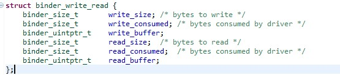
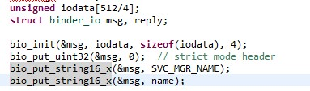

### binder 系统核心

IPC: 进程间的通信。A进程把数据发送到B进程。

RPC: 远程过程调用其它进程的某个函数。

​	调用哪一个函数？server 函数编号。例如：第一号，第二号。调用哪个函数就把编号发给它。

​        传给它什么参数？放到RPC的buf传给它。 里面返回值，也是同理通过buf 传回去的。双方约定好传输格式。

​        把数据发送给B，由B程序来操作硬件。在IPC的基础上做了一些封装。

ipc 是基础，负责数据传输。三大要素：

1，源：进程a .。问题？进程a 怎么知道进程b提供led 的访问？进程a如果操作c呢？应该向哪个进程发送数据？

2，目的 : 进程b。进程B 向serviceManager 注册led服务。进程A向serviceManager 查询led服务。得到一个handle。这个handle 就是指向进程B。

3，数据本身：就是char buf 。双方约定好数据的格式。

**对于Binder 系统涉及4个东西。**

 **ServiceManager**                        

  ① open 驱动

 ② 告诉驱动，它是serviceManager .

 ③  while 循环

​	    读驱动，获取数据

​	    解析数据

​	    调用两个函数

​	    a: 注册服务{在链表中 记录服务名字}

​	     b: 获取服务{b1:在链表中查询有没有服务 b2: 返回server 进程的handle}

**server**

​     ① open驱动

​     ② 注册服务{向serviceManager 发送服务的名字，把数据写入驱动程序}

​     ③ while循环 

​		读驱动

​		解析数据

​		调用对应的函数

​		

client 

  ①open驱动

  ②获取服务 {1，向serviceManger 查询服务获得一个handle，把数据发送驱动程序，指明要发给serviceManager.驱动程序知道谁是serviceManager}

  ③向handle 发送数据。

​					binder 驱动

参考代码：

frameworks\native\cmds\servicemanager 

**service_manager.c**

   **a,binder_open**

   **b,binder_become_context_manager**

   **c,binder_loop(bs,svcmgr_handler)**

​	c.1  res = ioctl(bs->fd, BINDER_WRITE_READ, &bwr); 读数据

​        c.2  binder_parse 除了解析数据还会处理数据

​		//解析

​		//处理：svcmgr_handler 注册服务，获取服务。

​			      SVC_MGR_GET_SERVICE /SVC_MGR_CHECK_SERVICE 获取服务

​			     SVC_MGR_ADD_SERVICE 注册服务。

​		//回复

​		 

**bctest.c**  半成品 。 实现了注册服务和获取服务。

**注册服务的过程：**

​	a.  binder_open

​	b.  svcmgr_publish , 构造好数据后，最终调用 binder_call ，要把数据发送到哪一个进程，由target来决定。 target 这里是0。句柄是0，进程间通信，要发送给谁。这个谁是用整数来表示的。当这个**整数是0 (BINDER_SERVICE_MANAGER)的时候，来表示要发送的是serviceManager** .它告诉驱动程序，本身自己就是serviceManager. 如果要把数据发送给为0的时候，驱动程序就知道要发给serviceManager. 

 binder_call(bs, &msg, &reply, target, SVC_MGR_ADD_SERVICE) ；

msg: 含有服务的名字。

reply:它会收到含有serviceManager 回复的数据。

code 表示调用serviceManager addService 

**获取服务的过程：**

a, binder_open

b,  svcmgr_lookup ，binder_call(bs, &msg, &reply, target, SVC_MGR_CHECK_SERVICE) 

​					msg: 含有服务的名字

​                                         reply: 它会含有servicemanager 回复的数据，表示提供服务的过程。

​					  code :表示调用serviceManager getService 

​                                      

### **binder.c** 分析  封装好的c函数。

binder_call 远程调用。向谁发数据。调用谁的哪个函数？提供什么参数。返回值是什么？

int binder_call(struct binder_state *bs,
                struct binder_io *msg, struct binder_io *reply,
                uint32_t target, uint32_t code)

向谁发数据：target 

调用哪个函数：code 

提供什么参数: msg 

返回值：reply 

怎么用？

①：构造参数放在buffer 。用结构体来描述。binder_io 。

②：调用 ioctl 来发数据。   res = ioctl(bs->fd, BINDER_WRITE_READ, &bwr);

​      **bwr**:   struct binder_write_read bwr;

	

​	转换：binder_io 转换 - > binder_write_read;过程

③：ioctl 也会收数据 。也会收到binder_write_read. 

​	也要转换成 binder_io .

例子：怎么构造binder_io

iodata :放数据的地方.

binder_io 用来描述iodata 的buf .

可以在iodata 中放入 int ,字符串等。构造好了之后，就会调用binder call .

数据发送给驱动程序，数据中除了binder_io 之外，还有target,code ,msg. **他们一起构造binder_write_read** 

writeBuf 定义：

 

