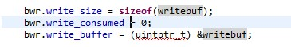
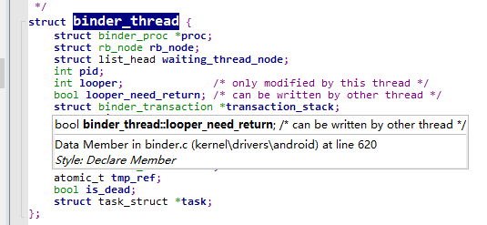
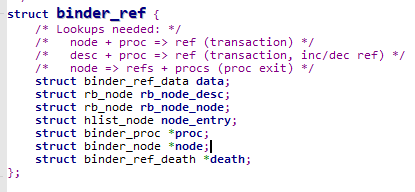
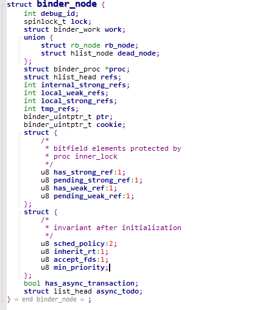
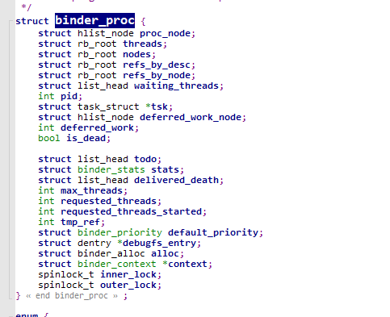
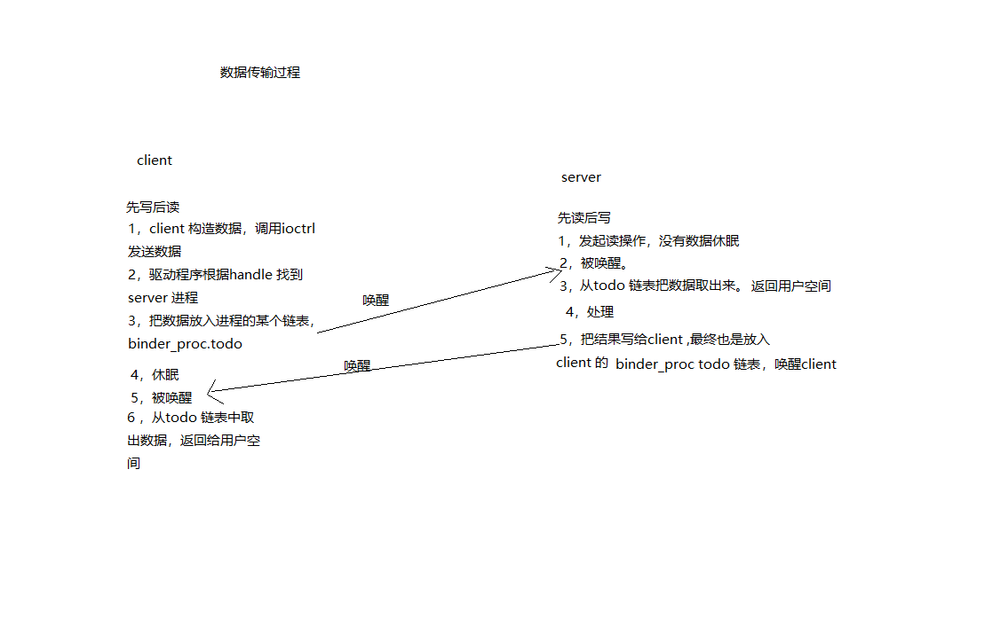

### binder 系统核心

IPC: 进程间的通信。A进程把数据发送到B进程。

RPC: 远程过程调用其它进程的某个函数。

​	调用哪一个函数？server 函数编号。例如：第一号，第二号。调用哪个函数就把编号发给它。

​        传给它什么参数？放到RPC的buf传给它。 里面返回值，也是同理通过buf 传回去的。双方约定好传输格式。

​        把数据发送给B，由B程序来操作硬件。在IPC的基础上做了一些封装。

ipc 是基础，负责数据传输。三大要素：

1，源：进程a .。问题？进程a 怎么知道进程b提供led 的访问？进程a如果操作c呢？应该向哪个进程发送数据？

2，目的 : 进程b。进程B 向serviceManager 注册led服务。进程A向serviceManager 查询led服务。得到一个handle。这个handle 就是指向进程B。

3，数据本身：就是char buf 。双方约定好数据的格式。

**对于Binder 系统涉及4个东西。**

 **ServiceManager**                        

  ① open 驱动

 ② 告诉驱动，它是serviceManager .

 ③  while 循环

​	    读驱动，获取数据

​	    解析数据

​	    调用两个函数

​	    a: 注册服务{在链表中 记录服务名字}

​	     b: 获取服务{b1:在链表中查询有没有服务 b2: 返回server 进程的handle}

**server**

​     ① open驱动

​     ② 注册服务{向serviceManager 发送服务的名字，把数据写入驱动程序}

​     ③ while循环 

​		读驱动

​		解析数据

​		调用对应的函数

​		

**client** 

  ①open驱动

  ②获取服务 {1，向serviceManger 查询服务获得一个handle，把数据发送驱动程序，指明要发给serviceManager.驱动程序知道谁是serviceManager}

  ③向handle 发送数据。

​					binder 驱动

参考代码：

frameworks\native\cmds\servicemanager 

**service_manager.c**

   **a,binder_open**

   **b,binder_become_context_manager** 告诉驱动，他是service_manager

   **c,binder_loop(bs,svcmgr_handler)**

​	c.1  res = ioctl(bs->fd, BINDER_WRITE_READ, &bwr); 读数据

​        c.2  binder_parse 除了解析数据还会处理数据

​		//解析

​		//处理：svcmgr_handler 注册服务，获取服务。

​			      SVC_MGR_GET_SERVICE /SVC_MGR_CHECK_SERVICE 获取服务

​			     SVC_MGR_ADD_SERVICE 注册服务。

​		//回复

​		 

**bctest.c**  半成品 。 实现了注册服务和获取服务。

**注册服务的过程：**

​	a.  binder_open

​	b.  svcmgr_publish , 构造好数据后，最终调用 binder_call ，要把数据发送到哪一个进程，由target来决定。 target 这里是0。句柄是0，进程间通信，要发送给谁。这个谁是用整数来表示的。当这个**整数是0 (BINDER_SERVICE_MANAGER)的时候，来表示要发送的是serviceManager** .它告诉驱动程序，本身自己就是serviceManager. 如果要把数据发送给为0的时候，驱动程序就知道要发给serviceManager. 

 binder_call(bs, &msg, &reply, target, SVC_MGR_ADD_SERVICE) ；

msg: 含有服务的名字。

reply:它会收到含有serviceManager 回复的数据。

code 表示调用serviceManager addService 

**获取服务的过程：**

a, binder_open

b,  svcmgr_lookup ，binder_call(bs, &msg, &reply, target, SVC_MGR_CHECK_SERVICE) 

​					msg: 含有服务的名字

​                                         reply: 它会含有servicemanager 回复的数据，表示提供服务的过程。

​					  code :表示调用serviceManager getService 

​                                      

### **binder.c** 分析  封装好的c函数。

binder_call 远程调用。向谁发数据。调用谁的哪个函数？提供什么参数。返回值是什么？

int binder_call(struct binder_state *bs,
                struct binder_io *msg, struct binder_io *reply,
                uint32_t target, uint32_t code)

向谁发数据：target 

调用哪个函数：code 

提供什么参数: msg 

返回值：reply 

怎么用？

①：构造参数放在buffer 。用结构体来描述。binder_io 。

②：调用 ioctl 来发数据。   res = ioctl(bs->fd, BINDER_WRITE_READ, &bwr);

​      **bwr**:   struct binder_write_read bwr;

	构造的是binder_io , 用到的是binder_write_read , 转换成驱动程序所要求的binder_write_read ?

​	转换：binder_io 转换 - > binder_write_read;过程

③：ioctl 也会收数据 。也会收到binder_write_read. 

​	也要转换成 binder_io .

例子：怎么构造binder_io，binder_io 会指向一个缓冲区。这个缓冲区是iodata ,实际上binder_io 是对这个缓冲区的管理。首先初始化，然后就可以对缓冲区里面放数据了。

iodata :放数据的地方.

binder_io 用来描述iodata 的buf .

可以在iodata 中放入 int ,字符串等。构造好了之后，就会调用binder call .

数据发送给驱动程序，数据中除了binder_io 之外，还有target,code ,msg. **他们一起构造binder_write_read** 

writeBuf 定义：

 

**binder_call内部实现**

**Client:** 

a,  binder_open。

b, 获得服务：服务进程的handle。

c, 构造参数：binder_io 

d，调用binder_call (handle,code,binder_io,)

e，binder_call 返回binder_io ，分析，取出返回值 （放在一个buf 中）

**server:**

a,binder_open

b,注册服务

c,ioctl (读) ，读到的数据是client发送的。，读取到handle,code ,参数

d,解析数据。得到binder_write_read ，readbuf -> 指向binder_transation_data 。 转换binder_io 

e,根据code ,来决定调用什么函数了。从binder_io 取出参数。传给要调用的函数，处理完之后，把返回值再次转换为binder_io 发给client 。

1，server 为在内核态驱动里 每个服务创建binder_node , binder_node.proc = server进程

2，service_manager  内核态驱动里 创建binder_ref ，引用binder_node 

​	 binder_ref.desc = 1,2,3.....

在用户态 创建服务链表 .链表中有name,有handle ，handle = binder_rer.desc

3,client 想service_manager 查询服务，传入name.

4,service_manager 返回handle给内核态，给驱动程序

5，驱动程序在service_manager 的binder_ref 红黑树。根据handle 找到binder_ref,在根据binder_ref.node 找到binder_node,

最后给这个client  创建新的binder_ref ，它的desc 从1开始。

驱动返回desc 给client ,它即为handle .

6,client 发送 到handle ,导致什么操作呢？

驱动根据handle 找到binder_ref ,在根据binder_ref 找到binder_node ,

在根据binder_node 找到server进程。

client 调用binder_call 向目的进程发送数据，handle 表示目的进程，binder_call 最终调用io_ctrl ,意味着，驱动程序使用handle 找到目的进程。在驱动内部，肯定有一个结构体来描述这个引用，它就是binder_ref

binder_ref 表示对服务的引用，那么怎么表示服务的呢？服务是binder_node .

驱动程序根据handle 找到binder_ref ,binder_ref 表示对某个服务的引用，根据binder_node *node ,找到对应的服务的binder_node ，在根据binder_node 中 binder_proc * proc找到对应进程.

**找到进程后，就可以把数据放到进程的某个链表中去了。**

真是的应用场景，会有多个client程序要求进程 提供服务。目标进程就会创建多个线程来向client 程序提供服务，进程B肯定有一个结构体来管理线程。就是**struct rb_root  threads;** 他是个红黑树，树的下面会挂有多个线程，线程会用binder_thread 来表示。每一个线程都会有binder_thread 结构体。

**binder_ref** 

binder_ref 用来描述一个Binder 引用的对象，在android 系统中，每一个 client 组件在Binder 驱动程序都有一个binder 引用对象。

**handle 是一个引用，进程a 对进程b提供的服务 的引用。**

**binder_node** 
结构体binder_node 用来定义Binder 实体对象，在android系统中，每一个service 组件在binder 驱动程序中都有一个Binder实体对象。

**binder_proc**

结构体binder_proc 表示正在使用的Binder 进程通信机制的进程，能够保存调用Binder的各个进程或线程信息，例如线程ID，进程ID，Binder 状态信息等。

找到binder_ref 就可以根据 node 找到bInder_node

client 是想向进程b发送数据，用handle 来表示进程b,通过handle 找到binder_ref 。通过binder_ref 找到node .通过binder_node 找到进程B，谁来表示进程B？在binder驱动中，使用binder_proc 来表示进程B。

binder_proc  某个服务从属于某个进程的。

进程a向进程b发送数据，调用ioctrl 传入一个handle ,根据handle 找到binder_ref . binder_ref 里面的desc 的描述等于handle , binder_ref 里面有一个指针。指向binder_node ,binder_node 是表示一个服务，binder_node 里面，有一项是binder_proc ,binder_proc 就是对应进程B，就把数据放到进程B的某个链表里面去了。

真实的应用场景会有多个client 程序，来向这个进程B要求提供服务，进程B就会创建多个线程，来向client 程序提供服务。进程B里面肯定有个结构体来管理线程。

### **binder 节点总结：**

binder_proc 中有 **rb_root  threads** ;是一个红黑树，这个树里面挂着多个线程，线程就是使用binder_thread 来表示。每一个线程都有个binder_thread 结构体。在这个引用过程中 源头是谁？

源头是server 的binder_node .

1,首先在内核态创建binder_node 别人才能引用你。server 为每个服务创建binder_node。binder_node 里面有proc 选项，binder_node.proc = server 进程。

2,service_manager 会在内核里面创建binder_ref 引用 binder_node .   binder_ref  有一项整数，binder_ref.desc = 1,2,3....

在用户态会创建服务链表，链表中有 服务的名字，hander  。 这个handle binder_ref.desc

3,client 向service_manager 查询服务。传name

4，service_manager 返回handle  给内核态给驱动程序。

5，驱动程序在service_manager 的binder_ref 红黑树中根据handle 找到bineder_ref 在根据binder_ref.node 找到binder_node 。

最后，给client 创建新的binder_ref .指向binder_node . 它的desc 从1 开始。

**驱动返回desc 给client 就是handle 。**

6，client 发送给handle ,驱动根据handle 找到binder_ref 。每个进程都有一些列binder_ref 根据整数号找到binder_ref 。再根据binder_ref 找到binder_node .根据binder_node 找到 server 进程 . 就可以传数据了

创建binder 是再内核态里面，所有的创建binder_node,binder_ref 都是再内核态驱动程序里面创建的。

### 数据传输过程（先写后读，进程切换）

### 数据如何复制

为了提供传输效率，使用mmap , 用户态可以直接操作内核态的内存。如果不使用mmap 来如何传输数据？

**一般方法** 

①client 构造好数据   。需要两次复制，效率比较低

② 驱动 copy_from_user    

**server**:

 1,驱动 copy_to_user

 2， 用户态处理。

**binder 方法**

① server mmap 用户态可以直接防访问 驱动中某块内存。

② client 构造数 驱动程序：copy_from_user  把用户态复制到内核的这块内存中。

③ server **程序客户以在用户态，直接使用数据。所以只需要一次拷贝。** 

④ 涉及结构体binder_buffer  。 数据只需要复制一次，数据头还是需要复制两次的。

例如:

​    io_ctrl 需要binder_write_read 这个结构体需要复制两次。这个结构体有某个指针指向发送的数据。

​    copy_from_user 到内存局部变量，然后copy_to_user 到service.

gi clone https://github.com/weidongshan/APP_0003_Binder_C_App.git

